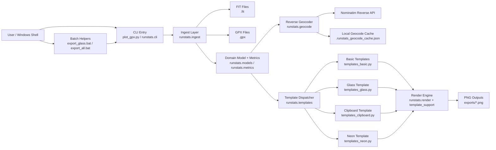

# RunStats Architecture

This repo is a local, file-driven PNG overlay generator for running activities.

## Container Diagram

## Runtime Flow

1. A user runs `plot_gpx.py`, `runstats`, or one of the `.bat` helpers.
2. The CLI resolves the input activity file and output path.
3. `runstats.ingest` parses FIT/GPX data into `ActivityData`.
4. `runstats.metrics` computes summary stats and merges FIT summary hints when present.
5. If `--location` is not provided, `runstats.geocode` reverse geocodes the start coordinate and caches the result locally.
6. `runstats.templates` dispatches to the selected template module.
7. The renderer produces a transparent PNG in `exports/` or the explicitly requested output path.

## Main Containers

- `CLI`: argument parsing, default paths, template choice, route mode, geocode trigger.
- `Ingest`: reads `.fit` / `.gpx` activity data and extracts track points plus Garmin session hints.
- `Models + Metrics`: immutable activity structures, cached derived arrays, pace/time/distance/elevation summary logic.
- `Geocoder`: optional location enrichment from start coordinates, with local JSON caching.
- `Templates`: visual layout modules for each overlay style.
- `Render Engine`: Matplotlib-based route plotting plus shared typography/figure helpers.
- `Outputs`: generated PNG overlays under `exports/`.

## Key Files

- [`plot_gpx.py`](/C:/Users/Eurus/Documents/GitHub/RunStats/plot_gpx.py)
- [`runstats/cli.py`](/C:/Users/Eurus/Documents/GitHub/RunStats/runstats/cli.py)
- [`runstats/ingest.py`](/C:/Users/Eurus/Documents/GitHub/RunStats/runstats/ingest.py)
- [`runstats/models.py`](/C:/Users/Eurus/Documents/GitHub/RunStats/runstats/models.py)
- [`runstats/metrics.py`](/C:/Users/Eurus/Documents/GitHub/RunStats/runstats/metrics.py)
- [`runstats/geocode.py`](/C:/Users/Eurus/Documents/GitHub/RunStats/runstats/geocode.py)
- [`runstats/templates.py`](/C:/Users/Eurus/Documents/GitHub/RunStats/runstats/templates.py)
- [`runstats/render.py`](/C:/Users/Eurus/Documents/GitHub/RunStats/runstats/render.py)
- [`runstats/template_support.py`](/C:/Users/Eurus/Documents/GitHub/RunStats/runstats/template_support.py)
